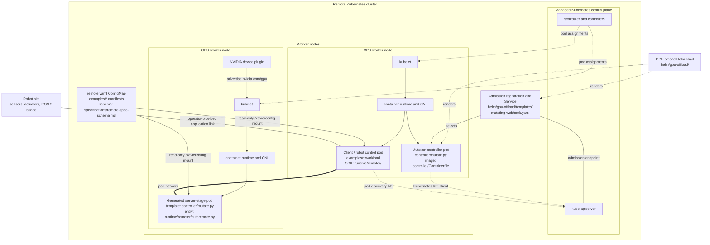
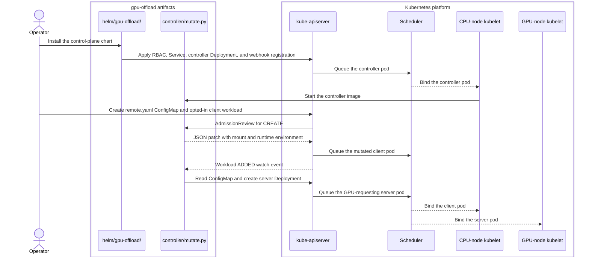
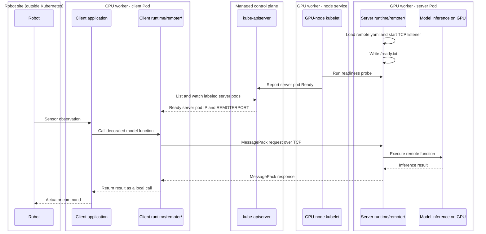

Transparent GPU offloading for robot inference: run a lightweight control container
next to the robot while heavy inference executes in a GPU server-stage pod. Offloading
is opt-in through workload label and annotation.

## 📋 Prerequisites

| Requirement                | Minimum                                               |
|----------------------------|-------------------------------------------------------|
| Kubernetes cluster         | CPU nodes, or GPU nodes with NVIDIA device plugin     |
| Container images           | `xavier-mutate` and `pyremote` in accessible registry |
| Tools                      | Helm 3 and `kubectl` configured                       |
| Python (controller tests)  | 3.12                                                  |
| Podman (local development) | 4.9.3 or later                                        |
| kind (local Kubernetes)    | 0.30.0                                                |

## 🚀 Quick Start

For a zero-to-verification local walkthrough, start with [docs/README.md](./docs/README.md). It covers the CPU-only, WSL2 NVIDIA, and bare-metal NVIDIA paths, all built on the same [first-run example](./examples/first-run/README.md).

1. Install the control plane:

   ```bash
   helm install gpu-offload ./helm/gpu-offload \
     --set image.registry=<your-registry>.azurecr.io
   ```

2. Add the `xavier: "true"` label and annotate workloads with `xavierconfig` pointing
   to a ConfigMap holding `remote.yaml`.

3. See [examples/so101-real-hardware/README.md](./examples/so101-real-hardware/README.md)
   for an end-to-end example (SO-101 arm with ROS 2 bridge), or
   [examples/ur10e-single/README.md](./examples/ur10e-single/README.md) for a UR10e
   running the unmodified `ur10e-single` deployment with the SDK layered into its
   image through `sitecustomize`

   The `ur10e-single` example provides a single-command hardware demo. Once its
   checkpoint and registry are set up, `mise run g-ur10e-52-demo` deploys the control
   loop, offloads the Pi0.5 policy to a GPU stage pod, drives the arm through the task,
   and homes it again.

## ⚙️ Configuration

Workload opt-in requires three signals:

| Signal                    | Location          | Value             | Purpose               |
|---------------------------|-------------------|-------------------|-----------------------|
| Label `xavier`            | Pod metadata      | `"true"`          | Select for mutation   |
| Annotation `xavierconfig` | Workload metadata | ConfigMap name    | Reference remote.yaml |
| Env `REMOTERPORT`         | Main container    | Port (e.g. 30001) | Server endpoint       |

The `xavierconfig` annotation points to a ConfigMap containing `remote.yaml`. See
[specifications/remote-spec-schema.md](./specifications/remote-spec-schema.md) for
schema documentation.

## 🏗️ Architecture

Controller-based mutation that watches Pods, Deployments, Jobs, and StatefulSets.
When a workload carries the opt-in signals, the controller:

1. Adds a ConfigMap volume mount for remote.yaml
2. Injects standard environment variables
3. Creates or reconciles server Deployments from configured server stages
4. Adds a readiness probe to generated server containers
5. Does not add hostPath volumes, host namespaces, or privileged contexts

Application and server images must contain the runtime SDK from `runtime/`.

### Remote cluster topology

The Kubernetes cluster is remote from the robot site. The robot communicates with
the client or control pod through a site-to-cluster application link such as a VPN,
private network, or ROS 2 bridge. This project does not provision that link.

<!-- cspell:ignore Containerfile rmtconfigkube msgtcp -->



| Diagram label                        | Meaning                                                                                                                                                                                                                                                                       |
|--------------------------------------|-------------------------------------------------------------------------------------------------------------------------------------------------------------------------------------------------------------------------------------------------------------------------------|
| Box containing a `gpu-offload/` path | Repository-owned artifact. The Helm chart renders RBAC, a `Service`, controller `Deployment`, TLS `Secret`, and `MutatingWebhookConfiguration`; runtime boxes are containers in client or server Pods; `remote.yaml` is mounted from a `ConfigMap`. This path defines no CRD. |
| Kubernetes or NVIDIA component name  | Cluster-supplied control plane, kubelet, container runtime, CNI, or externally installed device-plugin Pod or DaemonSet.                                                                                                                                                      |
| Physical equipment                   | Robot hardware outside Kubernetes; it is not a Kubernetes resource.                                                                                                                                                                                                           |
| Ungrouped sequence participant       | Operator-supplied application or model code running inside a client or server container.                                                                                                                                                                                      |

### Repository artifact map

| Diagram component     | Repository artifact                                                                                                               | Role                                                                                        |
|-----------------------|-----------------------------------------------------------------------------------------------------------------------------------|---------------------------------------------------------------------------------------------|
| Control-plane chart   | `helm/gpu-offload/`                                                                                                               | Render RBAC, Service, controller Deployment, TLS, and admission registration resources      |
| Mutation controller   | `controller/mutate.py`, `controller/Containerfile`                                                                                | Package the controller Pod, patch opted-in workloads, and reconcile server Deployments      |
| Runtime SDK           | `runtime/remoter/`                                                                                                                | Run inside client and server containers for decoration, discovery, execution, and transport |
| Runtime internals     | `runtime/remoter/rmtconfigkube.py`, `runtime/remoter/autoremote.py`, `runtime/remoter/safe_codec.py`, `runtime/remoter/msgtcp.py` | Watch Pods, start the server, encode MessagePack, and communicate over TCP                  |
| Offload configuration | `specifications/remote-spec-schema.md`                                                                                            | Define supported `remote.yaml` fields                                                       |
| Runnable workloads    | `examples/first-run/`, `examples/so101-real-hardware/`, `examples/ur10e-single/`                                                  | Provide client workloads, ConfigMaps, and offload boundaries                                |

### Deployment and admission sequence

The chart installs the controller. A separate workload submission triggers admission,
mutation, reconciliation, and node scheduling.



### Runtime offload sequence

| Participant                | Host and Kubernetes form                                                                      | Repository relationship                                                                      |
|----------------------------|-----------------------------------------------------------------------------------------------|----------------------------------------------------------------------------------------------|
| Robot                      | Physical robot site outside Kubernetes                                                        | Connects through operator-provided networking                                                |
| Client application and SDK | Processes in the same client container and Pod on a CPU worker node                           | Container includes `runtime/remoter/`; workload comes from `examples/` or operator manifests |
| API server                 | Managed Kubernetes control plane process, not a Pod managed by this chart                     | External platform dependency                                                                 |
| GPU kubelet                | Node service on the GPU worker, outside all Pods                                              | External Kubernetes node component                                                           |
| Server SDK and model       | Processes in the same `remote-server` container and generated server Pod on a GPU worker node | Deployment generated by `controller/mutate.py`; container includes `runtime/remoter/`        |



### Kubernetes node components

`kubelet` runs on every worker node as part of Kubernetes, not inside an application
pod and not as part of this Helm chart. It receives pod assignments, asks the
container runtime to start containers, mounts the ConfigMap, runs probes, and reports
pod status. The kubelet does not inspect or forward inference calls.

| Component                                  | Runs where                         | Responsibility in this design                                                |
|--------------------------------------------|------------------------------------|------------------------------------------------------------------------------|
| `kube-apiserver`                           | Managed control plane              | Accept workloads, invoke admission, and expose pod state                     |
| Scheduler and controllers                  | Managed control plane              | Select nodes and maintain Deployments and Pods                               |
| `kubelet`                                  | Every CPU and GPU worker node      | Start and monitor the pods assigned to its node                              |
| Container runtime                          | Every worker node                  | Run the mutation controller, client, and server containers                   |
| CNI plugin                                 | Every worker node                  | Provide routable pod IPs for client-to-server TCP traffic                    |
| NVIDIA device plugin                       | GPU worker nodes                   | Advertise `nvidia.com/gpu` resources to Kubernetes                           |
| `kube-proxy` or CNI service implementation | Worker nodes, depending on cluster | Route the webhook Service; inference uses discovered server pod IPs directly |
| Mutation controller                        | A regular cluster pod              | Mutate opted-in workloads and reconcile server Deployments                   |

> [!IMPORTANT]
> The disabled `node-agent-daemonset.yaml` is not a kubelet replacement. This fork
> does not install a privileged node agent, modify kubelet, or mount the host runtime.

## 📦 Repository Structure

| Path                            | Content                                        |
|---------------------------------|------------------------------------------------|
| `controller/`                   | Mutation controller (Python)                   |
| `helm/gpu-offload/`             | Helm chart for control plane                   |
| `runtime/`                      | Xavier remoting SDK with MessagePack transport |
| `registry/`                     | Host-local registry and pull-through caches    |
| `specifications/`               | Remote.yaml schema and opt-in contract         |
| `examples/so101-real-hardware/` | SO-101 end-to-end example                      |
| `examples/ur10e-single/`        | ur10e-single deployment, SDK layered in image  |

Additional reference documents:

- [XAVIER-PORTING.md](./XAVIER-PORTING.md): porting decisions and deviations
- [PROVENANCE.md](./PROVENANCE.md): upstream snapshot and licensing

## 📤 Implementation Status

| Feature                      | Status      | Notes                                                  |
|------------------------------|-------------|--------------------------------------------------------|
| Controller mutation          | Implemented | Label-selected admission with annotation configuration |
| ConfigMap volume mount       | Implemented | Read-only, mounted at /xavierconfig                    |
| Env var injection            | Implemented | REMOTER_CONFIG, downward API fields                    |
| Server readiness probe       | Implemented | Checks /ready.txt written by the runtime               |
| MessagePack codec            | Implemented | Versioned envelope and explicit adapters               |
| Server deployment generation | Implemented | Supports global and per-stage settings                 |
| Per-client deployments       | Implemented | Reconciled from admitted client Pods                   |

## ⚠️ Scope

This domain provides the offload contract, controller, runtime SDK, deployment
scaffolding, and examples. The real-hardware example is reference material; adapt it
to your hardware and build the SDK into both application and server images.

## 🧩 Tier Model

GPU offloading aligns with T3–T4 deployment topology concerns (single-site Kubernetes
to multi-site scale). It is NOT a T5 fleet-intelligence capability. See
[docs/design/tier-model.md](../docs/design/tier-model.md) for authoritative tier
definitions.

## 🔍 Troubleshooting

### Mutation does not occur

Verify the workload has label `xavier: "true"`, annotation
`xavierconfig` referencing a valid ConfigMap, and `REMOTERPORT` in its runtime container.

### Server-stage pod fails to start

Check that the server image is available from the configured registry and GPU nodes
have available capacity.
